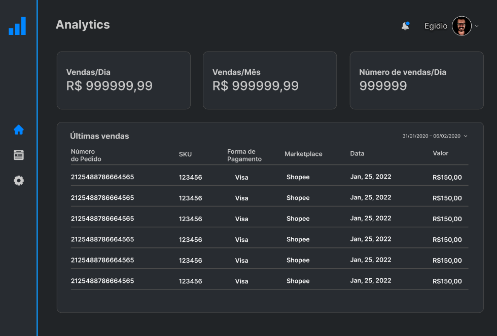

	

	

---

## :clipboard: Roadmap

Projeto criado durante o curso Full Stack Developer da Digital House.
*Project created during the Digital House Full Stack Developer course.*

 - [x] Wireframe
 - [x] Template 
 - [ ] Front-End
 - [ ] BackEnd  

---

## :file_folder: Projeto

O objetivo do projeto ***ECommerce Analytics*** é ser uma plataforma para facilitar a análise de dados dos usuários de Ecommerce, utilizando ERP's afim de buscar os dados em tempo real. 

*The objective of the ***ECommerce Analytics*** project is to be a platform to facilitate the analysis of data from Ecommerce users, using ERP's in order to search for data in real time.*

---

## :newspaper: Como está ficando ?

	
---

## :space_invader: Quem está fazendo ?

<table>
    <tr>
        <td align="center">
            <a href="https://github.com/egidioserri" target="_blank">
                
                 
                <b>Egidio</b>
            </a>
        </td>
    </tr>
</table>